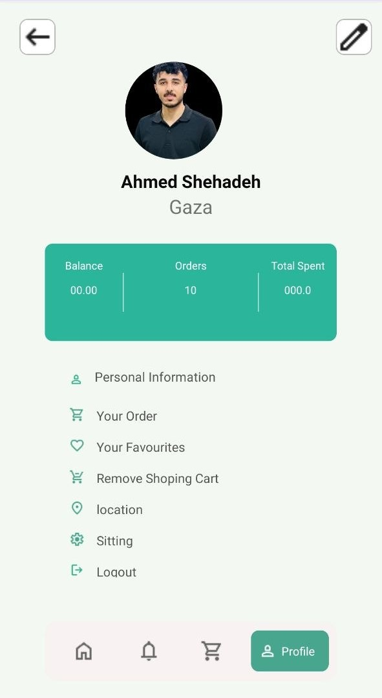
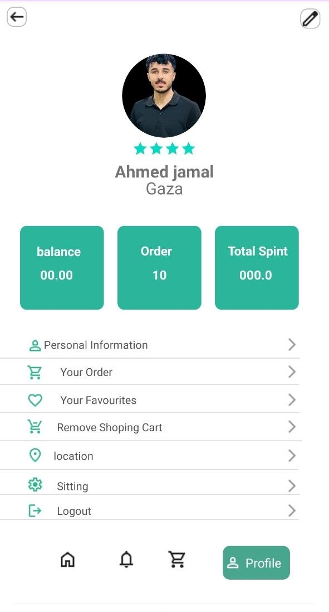

# Profile UI App

## Description

Profile UI App is an Android application project designed using Java and XML.

The project contains two profile screen designs:

- First screen built using **RelativeLayout**
- Second screen built using **ConstraintLayout**

## Features

- Profile image
- User name and location
- Balance, Orders, and Total Spent section
- Menu list with icons
- Rating stars
- Bottom navigation bar

## Technologies Used

- Android Studio
- Java
- XML
- RelativeLayout
- ConstraintLayout

## Project Purpose

This project was created to practice Android UI design and compare building the same profile screen using RelativeLayout and ConstraintLayout.
